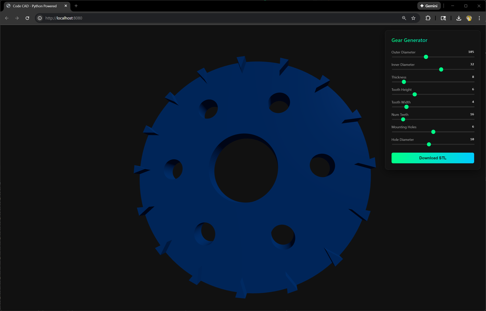

# Code CAD



A web-based CAD tool powered by Python (FastAPI, CadQuery) and JavaScript (Three.js).

## Requirements

- [Pixi](https://pixi.sh/) (for Python dependency management)
- [Bun](https://bun.sh/) (for JavaScript and testing)

## Installation

1. Install Python dependencies:
   ```bash
   pixi install
   ```

2. Install JavaScript dependencies:
   ```bash
   bun install
   ```

## Running the Project

### Start Everything
The easiest way to run the project is using the start script data:

```bash
bun start
```

This will:
- Start the Python FastAPI backend (with auto-reload).
- Start the Frontend server.
- Start the Logging service.
- Display logs in the console and save them to the `logs/` folder.

Open **[http://localhost:8080](http://localhost:8080)** in your browser to use the tool.

### verification Tests
To run the automated Puppeteer tests which verify the backend, frontend, and generation logic:

```bash
bun test
```

## Features

- **Parametric Design**: Adjust gear parameters (teeth count, diameter, thickness, etc.) in real-time.
- **3D Visualization**: View the generated 3D model using Three.js with orbit controls.
- **Download STL**: Export the generated model for 3D printing.
- **Logging**: Centralized logs saved to the `logs/` folder.

## Code Example

Creating a 3D model with CadQuery is simple and declarative. Here is a simplified snippet from `backend/gear_generator.py`:

```python
import cadquery as cq

# Create the main gear body
wheel = cq.Workplane("XY").cylinder(thickness, outer_diameter / 2.0)
wheel = wheel.faces(">Z").workplane().hole(inner_diameter)

# Create a single tooth
tooth = (cq.Workplane("XY")
         .moveTo(outer_diameter / 2.0 - tooth_height, 0)
         .lineTo(outer_diameter / 2.0, tooth_width / 2.0)
         .lineTo(outer_diameter / 2.0, -tooth_width / 2.0)
         .close()
         .extrude(thickness))

# Pattern the teeth
teeth = cq.Workplane("XY")
for i in range(num_teeth):
    angle = i * 360.0 / num_teeth
    rotated_tooth = tooth.rotate((0, 0, 0), (0, 0, 1), angle)
    teeth = teeth.union(rotated_tooth)

# Combine everything
result = wheel.union(teeth)
```

## About This Project

This project serves as a reference implementation for **connecting a custom web UI to a Python Computer-Aided Design (CAD) kernel**.

Many engineering tools require:
1.  **Parametric Design**: Users need to change values (like "number of teeth") and see results immediately.
2.  **Custom Interfaces**: Standard CAD software UIs are complex. A custom web UI can focus exactly on the parameters that matter for a specific workflow.
3.  **Visual Feedback**: Integrating Three.js allows for interactive 3D visualization without needing desktop software.

By using **FastAPI** to wrap **CadQuery**, we can expose the power of a scriptable CAD engine to any web frontend.

## Project Structure

- `backend/`: Python FastAPI application and CadQuery logic.
- `frontend/`: Static HTML/JS frontend using Three.js and dat.GUI.
- `test/`: TypeScript verification tests and infrastructure.
- `logs/`: Application logs (timestamped).
